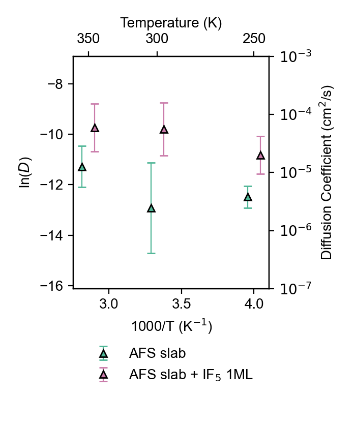
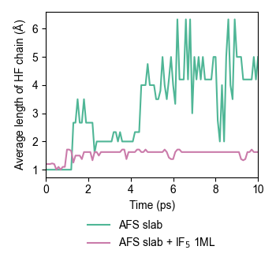
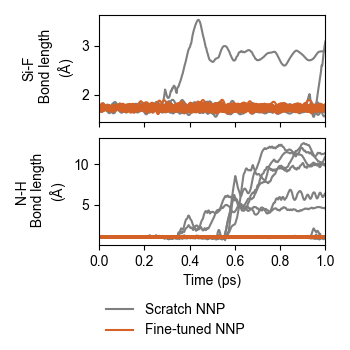
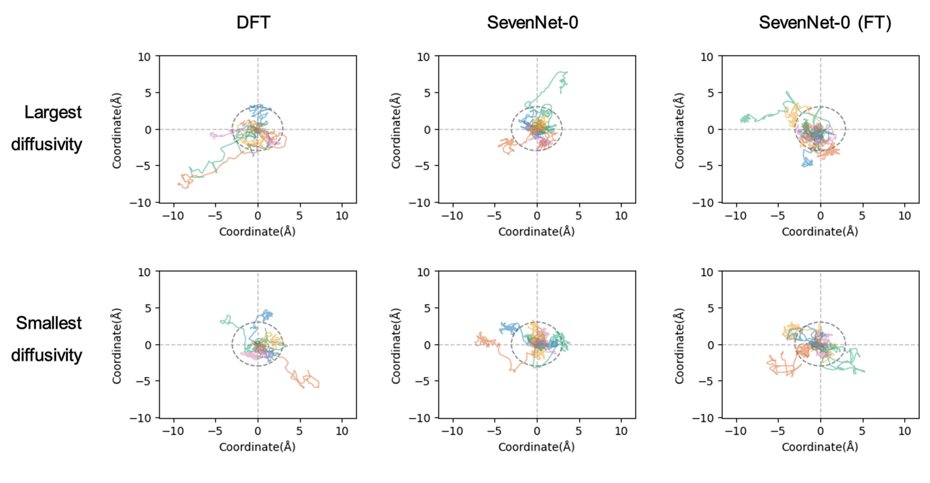
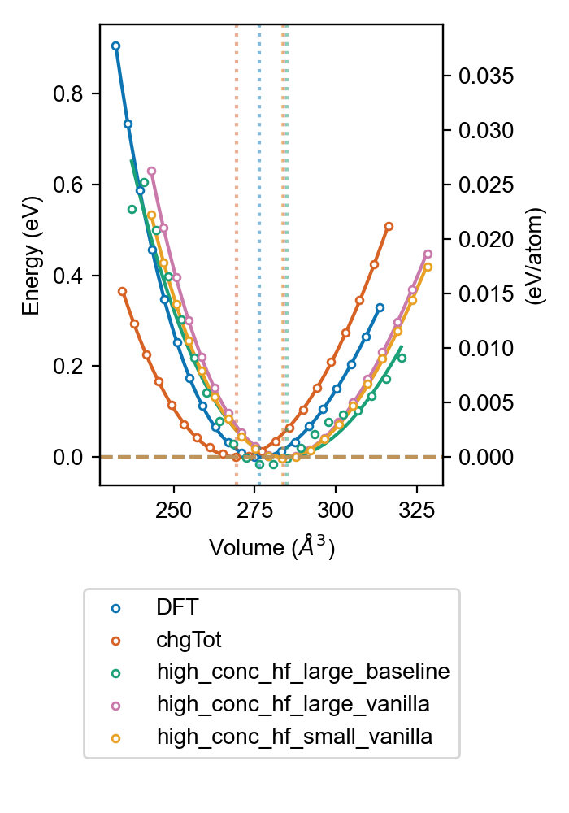

# Figures
## Main figures
### Figure 2
See `atom_config/`.

    

### Figure 3

### Figure 4

### Figure 5

### Figure 6
See `diffusivity/compare_mlip/`.

    

### Figure 7
See `diffusivity/additive_effect/`.

    

### Figure 8
See `chain_analysis/`.

    

## Supplementary figures
### Figure S1
1. Get bond length data using `bond_length_analysis/get_bond_length.py`.
2. Plot using `bond_length_analysis/plot_pdf.py`.

    

### Figure S2
See `trajectory/`.

    

### Figure S3

### Figure S4

### Figure S5

## Other figures
### EOS
See `etc/EOS/`.

    

