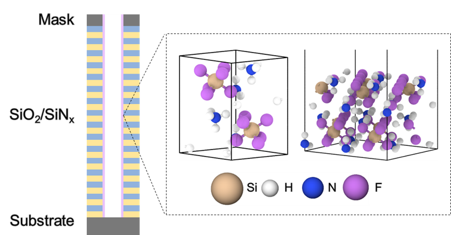
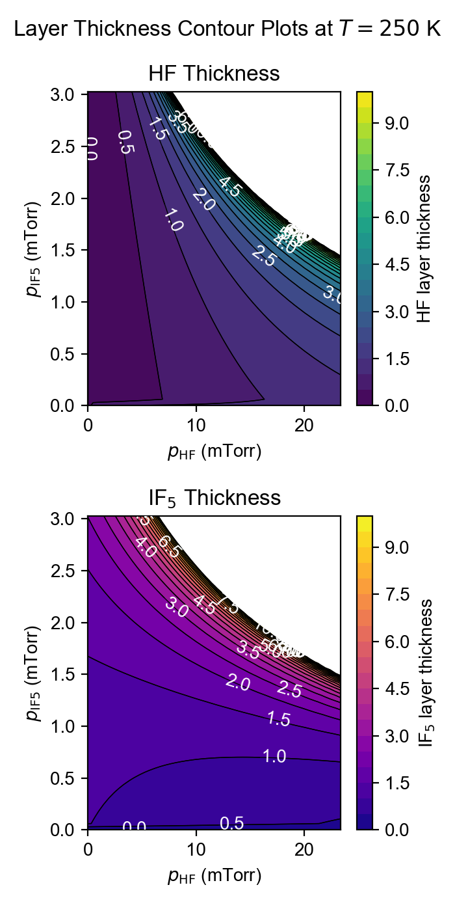

# Cryogenic etching modeling
- Adsorption & diffusion of HF on ammonium fluorosilicate ((NH4)2SiF6)
- With/without additive gas (IF5)

    

## Figures
See `Figures/README.md`.

    

## Fine-tuning
See `dataset/README.md`.

## Cite
An, H., Kim, J., Kim, G., & Han, S. (2025). Atomistic simulation of HF diffusion on ammonium fluorosilicate surface using neural network potential. *Modelling and Simulation in Materials Science and Engineering*, 33(4), 045015. [link](https://iopscience.iop.org/article/10.1088/1361-651X/add283/meta)

---

# Screening of gas additives
See `screening/`.

---

# BET modeling for multi-layer adsorption
See `bet_modeling/`.

    

